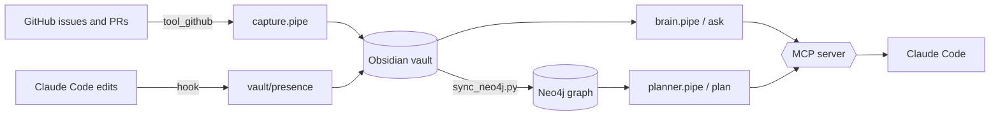

# Company Brain

**A team memory that captures your GitHub, answers in each teammate's language, and routes engineers around each other's work.**

Small teams lose hours to two invisible taxes: *syncing* ("what did you ship?", "what's the status?") and *translating* (an engineer re-explaining a change to a non-technical teammate). Company Brain watches the work — your GitHub issues and pull requests — writes it into an interlinked Markdown vault you can open in Obsidian, mirrors it into a Neo4j graph, and answers any question **in the asker's context**: as sales, as an engineer, or "give me a task that won't conflict with anyone."

It runs on [RocketRide](https://docs.rocketride.org) pipelines (a deep agent plus the GitHub and Neo4j nodes) and exposes itself to Claude Code as an MCP server — so you ask your coding agent and it answers from the brain.

## How it works

1. **Capture** — a RocketRide deep agent reads your repo's issues and PRs through `tool_github` and writes an interlinked Markdown vault (`vault/`, where `[[wikilinks]]` are the graph edges). Open it in Obsidian to *see* the brain.
2. **Ask, translated** — `ask` routes your question plus the vault to a deep agent that answers in your role: `--persona sales` (customer value, no jargon) or `--persona engineer` (PRs, files, what's still open).
3. **Presence** — the brain learns who is working on what from two signals: open/draft PRs and their changed files, and live edits (a Claude Code hook reports each session's edits into `vault/presence/`).
4. **Plan around conflicts** — `sync_neo4j.py` turns presence into a Neo4j graph of `(:Person)-[:WORKING_ON]->(:Feature)` edges; `plan` asks a deep agent (with the `db_neo4j` node) for an open issue in a feature nobody is touching — and names what to avoid and who to coordinate with.
5. **From Claude Code** — `companybrain_mcp.py` exposes `ask_company_brain` and `plan_task` as MCP tools, so any Claude Code session can pull from the brain.

## Architecture

| Layer | Stack | Role |
|-------|-------|------|
| Pipelines | RocketRide — `agent_deepagent`, `tool_github`, `db_neo4j`, `llm_openai` | capture / answer / plan, on the local engine |
| Brain (human) | Obsidian vault — Markdown + `[[wikilinks]]` | the graph you can see and read |
| Brain (machine) | Neo4j | the conflict graph the planner queries (natural language → Cypher) |
| Client | Python — `companybrain.py` | capture / ask / plan / presence; writes the vault |
| Agent bridge | MCP server — `companybrain_mcp.py` | `ask_company_brain` + `plan_task` for Claude Code |



## Requirements

- **Python 3.9+**
- A running **RocketRide local engine** at `ws://localhost:5565` (RocketRide app → Local mode, or self-hosted OSS)
- **Docker** — for the Neo4j conflict graph
- **GitHub CLI** (`gh`), authenticated — the brain reads issues/PRs
- An **OpenAI API key** — used by the deep-agent LLM nodes
- *Optional:* **Obsidian** (to see the vault graph) and **Claude Code** (for the MCP tools)

## Quickstart

```bash
# 1. install deps + configure
pip install -r requirements.txt
cp .env.example .env                       # then fill in ROCKETRIDE_OPENAI_KEY

# 2. seed a GitHub repo the brain will read (issues + PRs), under your account
gh auth status || gh auth login
REPO="$(gh api user -q .login)/company-brain-demo" ./seed_repo.sh
# set ROCKETRIDE_GITHUB_REPO in .env to that same owner/repo

# 3. build the brain from GitHub → vault/  (open vault/ in Obsidian)
python3 companybrain.py capture

# 4. ask it — same question, two contexts
python3 companybrain.py ask "what did Charlie ship?" --persona engineer
python3 companybrain.py ask "what did Charlie ship, and what does it mean for customers?" --persona sales

# 5. who's-working-on-what → a task that won't conflict
docker run -d --name cb-neo4j -p7474:7474 -p7687:7687 -e NEO4J_AUTH=neo4j/companybrain neo4j:5
./seed_more.sh                             # densify: ~20 open issues + parallel PRs across features
python3 companybrain.py log-activity --person charlie --working-on cloud-billing --files src/billing/meter.py
python3 companybrain.py log-activity --person josh    --working-on observability  --files src/observability/logs.py
python3 companybrain.py build-vault        # deterministic vault + Neo4j graph (kept 1:1)
python3 companybrain.py plan "what can I pick up that won't conflict with anyone?"
```

Wire it into **Claude Code** (exposes `ask_company_brain` + `plan_task`):

```bash
claude mcp add company-brain -- python3 "$(pwd)/companybrain_mcp.py"
# then in any session: "ask the company brain for a task that won't conflict with anyone"
```

See the conflict graph at **http://localhost:7474** (`neo4j` / `companybrain`):

```cypher
MATCH (p:Person)-[:WORKING_ON]->(f:Feature) RETURN p, f
```

## Configuration

`companybrain.py` auto-loads `./.env` (no `python-dotenv` required). Keys:

| Variable | What it's for |
|----------|---------------|
| `ROCKETRIDE_URI` / `ROCKETRIDE_APIKEY` | local engine endpoint + OSS key (any non-empty key works) |
| `ROCKETRIDE_OPENAI_KEY` | the deep-agent LLM nodes (resolved client-side at run time) |
| `ROCKETRIDE_GITHUB_REPO` | the `owner/repo` the brain reads issues/PRs from |
| `ROCKETRIDE_NEO4J_URI` / `_USER` / `_PASSWORD` | Neo4j creds the `planner.pipe` `db_neo4j` node uses |
| `COMPANYBRAIN_NEO4J_URI` / `_USER` / `_PASSWORD` | Neo4j creds `sync_neo4j.py` uses — keep the same as above |

## Repository layout

| Path | What |
|------|------|
| `capture.pipe`, `brain.pipe`, `planner.pipe`, `log.pipe` | the RocketRide pipelines |
| `companybrain.py` | the client CLI — `capture`, `ask`, `plan`, `log-activity`, `log-issue`, `build-vault` |
| `companybrain_mcp.py` | the MCP server for Claude Code (`ask_company_brain`, `plan_task`) |
| `sync_neo4j.py` | builds the Neo4j conflict graph and the deterministic vault |
| `hooks/report_activity.py` | the Claude Code `PostToolUse` presence hook (inert unless `COMPANYBRAIN_USER` is set) |
| `vault/` | a sample brain — interlinked notes under `people/ prs/ issues/ features/ presence/` |
| `seed_repo.sh`, `seed_more.sh` | create and densify the demo GitHub repo |
| `make_news.sh`, `watch_pipelines.py` | *optional dev/demo tools* — script a live PR; tail the engine's pipeline trace |
